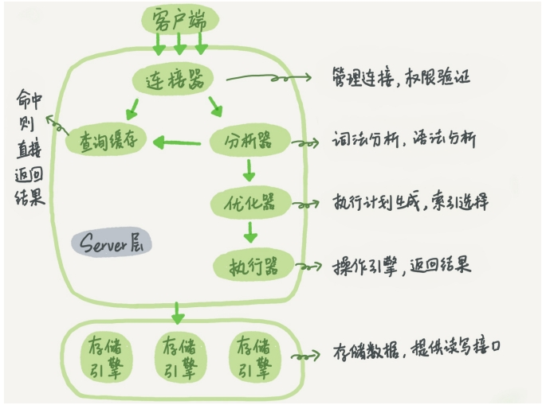
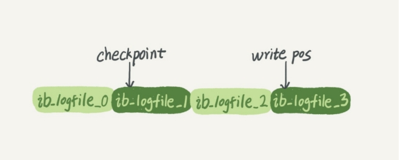
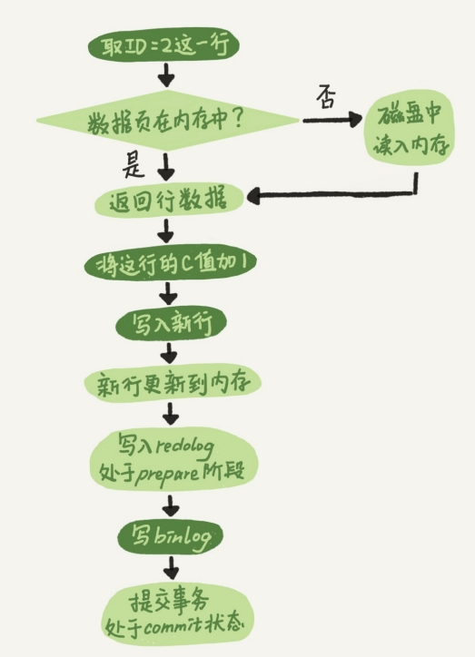
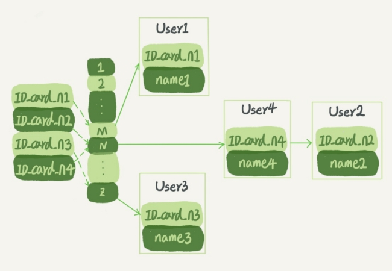

# 数据库

## 基本概念

三大数据模型：

- 关系模型：表的形式组织数据
- 层次模型：树的形式组织数据
- 网状模型：图的形式组织数据


--WHERE分组之前过滤数据，不能过滤聚合函数的结果

--having分组后再筛选满足条件的组，可过滤聚合函数的结果
--WHERE 用在group by前，having在group by之后


1. 事务（transaction）：一组 SQL 语句
2. 回退（rollback）：撤销指定 SQL 语句的过程
3. 提交（commit）：将未存储的 SQL 语句结果写入数据库表
4. 保留点（savepoint）：事务处理中设置的临时占位符（placeholder），你可以对它发布回退（与回退整个事务处理不同）


## MySQL 实战45讲

### 基础架构：一条 SQL 查询语句是如何执行的？



MySQL 可以分为 Server 层和存储引擎层：

- **Server层**包括连接器、查询缓存、分析器、优化器、执行器等，涵盖MySQL的大多数核心服务 功能，以及所有的内置函数（如日期、时间、数学和加密函数等），所有跨存储引擎的功能都在 这一层实现，比如存储过程、触发器、视图等。
- **存储引擎层**负责数据的存储和提取。其架构模式是插件式的，支持InnoDB、MyISAM、 Memory等多个存储引擎。现在最常用的存储引擎是InnoDB，它从MySQL 5.5.5版本开始成为了 默认存储引擎。

#### 基本流程

##### 连接器

连接器负责跟客户端建立连 接、获取权限、维持和管理连接。连接命令一般是这么写的：

```shell
mysql -h$ip -P$port -u$user -p
```

连接命令中的mysql是客户端工具，用来跟服务端建立连接。在完成经典的TCP握手后，连接器就要开始认证你的身份，这个时候用的就是你输入的用户名和密码。

- 如果用户名或密码不对，你就会收到一个"Access denied for user"的错误，然后客户端程序结束执行。
- 如果用户名密码认证通过，连接器会到权限表里面查出你拥有的权限。之后，这个连接里面的权限判断逻辑，都将依赖于此时读到的权限。

一个用户成功建立连接后，即使你用管理员账号对这个用户的权限做了修改，也不会影响已经存在连接的权限。修改完成后，只有再新建的连接才会使用新的权限设置。

**客户端如果太长时间没动静，连接器就会自动将它断开。**这个时间是由参数 wait_timeout 控制的，默认值是8小时。


> MySQL 的长连接和短连接如何抉择？

数据库里面，长连接指连接成功后，如果客户端持续有请求，则一直使用同一个连接。

短连接指每次执行完很少的几次查询就断开连接，下次查询再重新建立一个。

但是全部使用长连接后，MySQL 占用内存涨得特别快，这是因为 MySQL 在执行过程中临时使用的内存是管理在连接对象里面的。这些资源在连接断开的时候才释放。所以如果长连接累积下来，可能导致内存占用太大，被系统强行杀掉（OOM），从现象看就是MySQL异常重启了。

两种解决方案：

1. **定期断开长连接**。使用一段时间，或者程序里面判断执行过一个占用内存的大查询后，断开连接，之后要查询再重连。
2. 如果用的是 MySQL 5.7 或更新版本，可以在每次执行一个比较大的操作后，通过执行 mysql_reset_connection 来重新初始化连接资源。这个过程不需要重连和重新做权限验证， 但是会将连接恢复到刚刚创建完时的状态。


##### 查询缓存

MySQL 拿到一个查询请求后，会先到查询缓存查找，之前是不是执行过这条语句。之前执行过的语句及其结果可能会以 key-value 对的形式，被直接缓存在内存中。key 是查询的语句，value 是查询的结果。如果你的查询能够直接在这个缓存中找到key，那么这个 value 就会被直接返回给客 户端。

如果语句不在查询缓存中，就会继续后面的执行阶段。执行完成后，执行结果会被存入查询缓存中。如果查询命中缓存，MySQL不需要执行后面的复杂操作，就可以直接返回结果，这个效率会很高。

**但是，查询缓存的失效非常频繁，只要有对一个表的更新，这个表上所有的查询缓存都会被清空。**

并且 MySQL 8.0 版本直接将查询缓存的整块功能删掉了。


##### 分析器

分析器先会做“词法分析”。你输入的是由多个字符串和空格组成的一条SQL语句，MySQL需要识别出里面的字符串分别是什么，代表什么。

然后是做“语法分析”。根据词法分析的结果，语法分析器会根据语法规则， 判断你输入的这个SQL语句是否满足MySQL语法。


##### 优化器

经过了分析器，MySQL就知道你要做什么了。在开始执行之前，还要先经过优化器的处理。

优化器是在表里面有多个索引的时候，决定使用哪个索引；或者在一个语句有多表关联（join） 的时候，决定各个表的连接顺序。

优化器阶段完成后，这个语句的执行方案就确定下来了，然后进入执行器阶段。


##### 执行器

MySQL通过分析器知道了你要做什么，通过优化器知道了该怎么做，于是就进入了执行器阶段，开始执行语句。

1. 开始执行的时候，要先判断一下你对这个表 T 有没有执行查询的权限，如果没有，就会返回没有权限的错误。
2. 如果有权限，就打开表继续执行。打开表的时候，执行器就会根据表的引擎定义，去使用这个引擎提供的接口。


### 日志系统：一条 SQL 更新语句是如何执行的？

MySQL 里经常说到的WAL技术，WAL 的全称是 WriteAhead Logging，它的关键点就是先写日志，再写磁盘。

当有一条记录需要更新的时候，InnoDB引擎就会先把记录写到redo log里面，并更新内存，这个时候更新就算完成了。同时，InnoDB引擎会在适当的时候，将这个操作记录更新到磁盘里面，而这个更新往往是在系统比较空闲的时候做。

InnoDB 的redo log 是固定大小的，比如可以配置为一组4个文件，每个文件的大小是 1GB，那么这块“粉板”总共就可以记录4GB的操作。



write pos是当前记录的位置，一边写一边后移，写到第3号文件末尾后就回到0号文件开头。 checkpoint是当前要擦除的位置，也是往后推移并且循环的，擦除记录前要把记录更新到数据文件。 write pos和checkpoint之间的是“粉板”上还空着的部分，可以用来记录新的操作。

如果write pos 追上checkpoint，表示“粉板”满了，这时候不能再执行新的更新，得停下来先擦掉一些记录，把 checkpoint 推进一下。

有了redo log，InnoDB就可以保证即使数据库发生异常重启，之前提交的记录都不会丢失，这个能力称为crash-safe。


> redo log 和 bin log 的区别？

1.  redo log是InnoDB引擎特有的；binlog是MySQL的Server层实现的，所有引擎都可以使用。
2. redo log是物理日志，记录的是“在某个数据页上做了什么修改”；binlog是逻辑日志，记录的是这个语句的原始逻辑，比如“给ID=2这一行的c字段加1 ”。
3. redo log是循环写的，空间固定会用完；binlog是可以追加写入的。“追加写”是指binlog文件 写到一定大小后会切换到下一个，并不会覆盖以前的日志。




（图中浅色框表示是在InnoDB内部执行的，深色框表示是在执行器中执行的。）

1. 执行器先找引擎取ID=2这一行。ID是主键，引擎直接用树搜索找到这一行。如果ID=2这一行所在的数据页本来就在内存中，就直接返回给执行器；否则，需要先从磁盘读入内存，然 后再返回。
2. 执行器拿到引擎给的行数据，把这个值加上1，比如原来是N，现在就是N+1，得到新的一行数据，再调用引擎接口写入这行新数据。
3. 引擎将这行新数据更新到内存中，同时将这个更新操作记录到redo log里面，此时redo log处于prepare状态。然后告知执行器执行完成了，随时可以提交事务。
4. 执行器生成这个操作的binlog，并把 binlog 写入磁盘。
5. 执行器调用引擎的提交事务接口，引擎把刚刚写入的redo log改成提交（commit）状态，更新完成。


> 说一下 prepare 和 commit 的两阶段提交

为了让两份日志之间的逻辑一致。

如果不使用“两阶段提交”，那么数据库的状态就有可能和用它的日志恢复出来的库的状态不一致。


### 事务隔离：为什么你改了我还看不见？

事务就是要保证一组数据库操作，要么全部成功，要么全部失败。在MySQL中，事务支持是在引擎层实现的。

MyISAM 引擎不支持事务，而 InnoDB 引擎支持事务。

SQL标准的事务隔离级别包括：读未提交（read uncommitted）、读提交（read committed）、可重复读（repeatable read）和串行化（serializable）。

1. **读未提交**：一个事务还没提交时，它做的变更就能被别的事务看到。
2. **读提交**：一个事务提交后，它做的更改才会被其他事务看到。
3. **可重复读**：一个事务执行过程中看到的数据，总是跟这个事务在启动时看到的数据是一致的。当然在可重复读隔离级别下，未提交变更对其他事务也是不可见的。
4. **串行化**：对于同一条记录，写操作会加写锁，读操作会加读锁。当出现读写锁冲突的时候，后访问的事务必须等前一个事务执行完成才能继续执行。

在实现上，数据库里面会创建一个视图，访问的时候以视图的逻辑结果为准。在**“可重复读”**隔离级别下，这个视图是在事务启动时创建的，整个事务存在期间都用这个视图。在**“读提交”**隔离级别下，这个视图是在每个SQL语句开始执行的时候创建的。这里需要注意的是，**“读未提交”**隔离级别下直接返回记录上的最新值，没有视图概念；而**“串行化”**隔离级别下直接用加锁的方式来避免并行访问。


### 索引

索引的出现其实就是为了提高数据查询的效率，就像书的目录一样。索引的常见模型主要有三种：哈希表、有序数组和搜索树。

- 哈希表

  

  哈希的思路很简单，把值放在数组里，用一个哈希函数把key换算成一个确定的位置，然后把value放在数组的这个位置。多个 key 值经过哈希函数换算有可能会出现同一个值的情况，这也叫做哈希冲突。此时可以使用一个链表来储存同一哈希值的 key。

- 有序数组

- 搜索树


