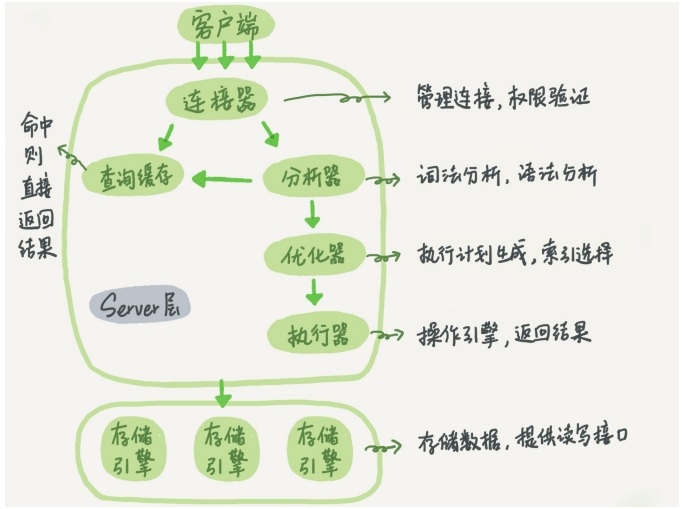
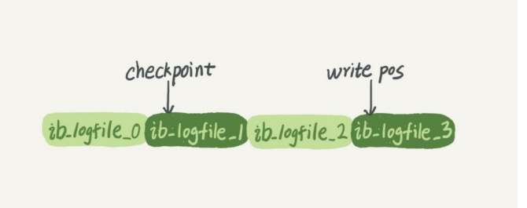
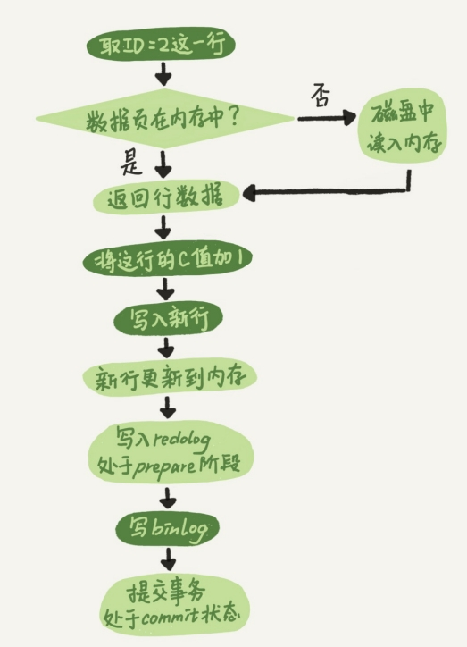

# 数据库

## 基本概念

### 索引

#### 索引的分类

- 按「数据结构」分类：**B+tree索引、Hash索引、Full-text索引**。
- 按「物理存储」分类：**聚簇索引（主键索引）、二级索引（辅助索引）**。
- 按「字段特性」分类：**主键索引、唯一索引、普通索引、前缀索引**。
- 按「字段个数」分类：**单列索引、联合索引**。


##### 按数据结构分类


在创建表时，InnoDB 存储引擎会根据不同的场景选择不同的列作为索引：

- 如果有主键，默认会使用**主键**作为聚簇索引的索引键（key）；
- 如果没有主键，就选择第一个**不包含 NULL 值的唯一列**作为聚簇索引的索引键（key）；
- 在上面两个都没有的情况下，InnoDB 将自动生成一个**隐式自增 id 列**作为聚簇索引的索引键（key）；

其它索引都属于辅助索引（Secondary Index），也被称为二级索引或非聚簇索引。**创建的主键索引和二级索引默认使用的是 B+Tree 索引**。


##### 按照物理存储分类

从物理存储的角度来看，索引分为聚簇索引（主键索引）、二级索引（辅助索引）。

这两个区别在前面也提到了：

- 主键索引的 B+Tree 的叶子节点存放的是**实际数据**，所有完整的用户记录都存放在主键索引的 B+Tree 的叶子节点里；
- 二级索引的 B+Tree 的叶子节点存放的是**主键值**，而不是实际数据。

所以，在查询时使用了二级索引，如果查询的数据能在二级索引里查询的到，那么就不需要回表，这个过程就是覆盖索引。如果查询的数据不在二级索引里，就会先检索二级索引，找到对应的叶子节点，获取到主键值后，然后再检索主键索引，就能查询到数据了，这个过程就是回表。


##### 按照字段特性分类

从字段特性的角度来看，索引分为主键索引、唯一索引、普通索引、前缀索引。

**1、主键索引**

主键索引就是建立在主键字段上的索引，通常在创建表的时候一起创建，一张表最多只有一个主键索引，索引列的值不允许有空值。

在创建表时，创建主键索引的方式如下：

```mysql
CREATE TABLE table_name  (
  ....
  PRIMARY KEY (index_column_1) USING BTREE
);
```


**2、唯一索引**

唯一索引建立在 UNIQUE 字段上的索引，一张表可以有多个唯一索引，索引列的值必须唯一，但是允许有空值。

在创建表时，创建唯一索引的方式如下：

```sql
CREATE TABLE table_name  (
  ....
  UNIQUE KEY(index_column_1,index_column_2,...) 
);
```


**3、普通索引**

普通索引就是建立在普通字段上的索引，既不要求字段为主键，也不要求字段为 UNIQUE。

在创建表时，创建普通索引的方式如下：

```sql
CREATE TABLE table_name  (
  ....
  INDEX(index_column_1,index_column_2,...) 
);
```

建表后，如果要创建普通索引，可以使用这面这条命令：

```sql
CREATE INDEX index_name
ON table_name(index_column_1,index_column_2,...); 
```


**4、前缀索引**

前缀索引是指对字符类型字段的前几个字符建立的索引，而不是在整个字段上建立的索引，前缀索引可以建立在字段类型为 char、 varchar、binary、varbinary 的列上。

使用前缀索引的目的是为了减少索引占用的存储空间，提升查询效率。

在创建表时，创建前缀索引的方式如下：

```sql
CREATE TABLE table_name(
    column_list,
    INDEX(column_name(length))
); 
```

建表后，如果要创建前缀索引，可以使用这面这条命令：

```sql
CREATE INDEX index_name
ON table_name(column_name(length)); 
```


##### 按照字段个数分类

从字段个数的角度来看，索引分为单列索引、联合索引（复合索引）。

- 建立在单列上的索引称为单列索引，比如主键索引；
- 建立在多列上的索引称为联合索引；

**1、联合索引**

通过将多个字段组合成一个索引，该索引就被称为联合索引。比如将商品表中的 product_no 和 name 字段组合成联合索引`(product_no, name)`，创建联合索引的方式如下：

```sql
CREATE INDEX index_product_no_name ON product(product_no, name);
```


**联合索引的最左匹配原则，在遇到范围查询（>、<、between、like 包括like '林%'这种）的时候，就会停止匹配，也就是范围列可以用到联合索引，但是范围列后面的列无法用到联合索引**。

对于联合索引（a, b），在执行 `select * from table where a > 1 and b = 2` 语句的时候，只有 a 字段能用到索引，那在联合索引的 B+Tree 找到第一个满足条件的主键值（ID 为 2）后，还需要判断其他条件是否满足（看 b 是否等于 2）

> 那么是在联合索引里判断？还是回主键索引去判断呢？

- 在 MySQL 5.6 之前，只能从 ID2 （主键值）开始一个个回表，到「主键索引」上找出数据行，再对比 b 字段值。
- 而 MySQL 5.6 引入的**索引下推优化**（index condition pushdown)， **可以在联合索引遍历过程中，对联合索引中包含的字段先做判断，直接过滤掉不满足条件的记录，减少回表次数**。


#### B+ Tree 索引


B+Tree 是一种多叉树，叶子节点才存放数据，非叶子节点只存放索引，而且每个节点里的数据是**按主键顺序存放**的。每一层父节点的索引值都会出现在下层子节点的索引值中，因此在叶子节点中，包括了所有的索引值信息，并且每一个叶子节点都指向下一个叶子节点，形成一个链表。

##### 通过主键查询商品数据的过程

比如，我们执行了下面这条查询语句，这条语句使用了主键索引查询 id 号为 5 的商品。查询过程是这样的，B+Tree 会自顶向下逐层进行查找：

- 将 5 与根节点的索引数据 (1，10，20) 比较，5 在 1 和 10 之间，所以根据 B+Tree的搜索逻辑，找到第二层的索引数据 (1，4，7)；
- 在第二层的索引数据 (1，4，7)中进行查找，因为 5 在 4 和 7 之间，所以找到第三层的索引数据（4，5，6）；
- 在叶子节点的索引数据（4，5，6）中进行查找，然后我们找到了索引值为 5 的行数据。

数据库的索引和数据都是存储在硬盘的，我们可以把**读取一个节点当作一次磁盘 I/O 操作**。那么上面的整个查询过程一共经历了 3 个节点，也就是进行了 3 次 I/O 操作。

B+Tree 存储千万级的数据只需要 3-4 层高度就可以满足，这意味着从千万级的表查询目标数据最多需要 3-4 次磁盘 I/O，所以**B+Tree 相比于 B 树和二叉树来说，最大的优势在于查询效率很高，因为即使在数据量很大的情况，查询一个数据的磁盘 I/O 依然维持在 3-4次。**


##### 通过二级索引查询商品数据的过程

主键索引的 B+Tree 和二级索引的 B+Tree 区别如下：

- 主键索引的 B+Tree 的叶子节点存放的是实际数据，所有完整的用户记录都存放在主键索引的 B+Tree 的叶子节点里；
- 二级索引的 B+Tree 的叶子节点存放的是主键值，而不是实际数据。

我这里将前面的商品表中的 product_no （商品编码）字段设置为二级索引，那么二级索引的 B+Tree 如下图，其中非叶子的 key 值是 product_no（图中橙色部分），叶子节点存储的数据是主键值（图中绿色部分）。


会先检二级索引中的 B+Tree 的索引值（商品编码，product_no），找到对应的叶子节点，然后获取主键值，然后再通过主键索引中的 B+Tree 树查询到对应的叶子节点，然后获取整行数据。**这个过程叫「回表」，也就是说要查两个 B+Tree 才能查到数据**。


当查询的数据是能在二级索引的 B+Tree 的叶子节点里查询到，这时就不用再查主键索引查。**这种在二级索引的 B+Tree 就能查询到结果的过程就叫作「覆盖索引」，也就是只需要查一个 B+Tree 就能找到数据**。


### left join,right join,inner join


- left join(左联接) 返回包括左表中的所有记录和右表中联结字段相等的记录，右表中记录不足的地方均为NULL。
- right join(右联接) 返回包括右表中的所有记录和左表中联结字段相等的记录，右左表中记录不足的地方均为NULL。
- inner join(等值连接) 只返回两个表中联结字段相等的行


外连接 (OUTER JOIN)分为三种
**1. 左外连接 (LEFT OUTER JOIN 或 LEFT JOIN）：**左表的记录将会全部表示出来，而右表只会显示符合搜索条件的记录，右表记录不足的地方均为NULL
**2. 右外连接 (RIGHT OUTER JOIN 或 RIGHT JOIN)：**与左(外)连接相反，右(外)连接，右表的记录将会全部表示出来，而左表只会显示符合搜索条件的记录，左表记录不足的地方均为NULL
**3. 全外连接 (FULL OUTER JOIN 或 FULL JOIN)：**左表和右表都不做限制，所有的记录都显示，两表不足的地方用null 填充
**MySQL中不支持全外连接，可以使用 UNION 来合并两个或多个 SELECT 语句的结果集**


### B+ 树的索引机制

InnoDB 存储引擎默认会创建一个主键索引，也就是聚簇索引，**其它索引都属于二级索引**。

MySQL 的 MyISAM 存储引擎支持多种索引数据结构，比如 B+ 树索引、R 树索引、Full-Text 索引。MyISAM 存储引擎在创建表时，创建的主键索引默认使用的是 B+ 树索引。

虽然，InnoDB 和 MyISAM 都支持 B+ 树索引，但是它们数据的存储结构实现方式不同。不同之处在于：

- InnoDB 存储引擎：B+ 树索引的叶子节点保存数据本身；
- MyISAM 存储引擎：B+ 树索引的叶子节点保存数据的物理地址；


> 为什么 like 关键字左或者左右模糊匹配无法走索引呢？

```sql
# name 字段为二级索引
select * from t_user where name like '%林';
select * from t_user where name like '林%';
```

**因为索引 B+ 树是按照「索引值」有序排列存储的，只能根据前缀进行比较。**

如果是 like 关键字右模糊匹配的话，因为可以比较前缀的大小来进行查询，所以可以通过索引查找。否则只能通过全表扫描的方式来进行查询。


> 为什么对索引使用函数，就无法走索引了呢？

```sql
# name 为二级索引
select * from t_user where length(name) = 6;
```

因为索引保存的是索引字段的原始值，而不是经过函数计算后的值，自然就没办法走索引了。

不过，从 MySQL 8.0 开始，索引特性增加了函数索引，即可以针对函数计算后的值建立一个索引，也就是说该索引的值是函数计算后的值，所以就可以通过扫描索引来查询数据。


> 为什么对索引进行表达式计算，就无法走索引了呢？

```sql
select * from t_user where id + 1 = 10;
```

因为索引保存的是索引字段的原始值，而不是 id + 1 表达式计算后的值，所以无法走索引，只能通过把索引字段的取值都取出来，然后依次进行表达式的计算来进行条件判断，因此采用的就是全表扫描的方式。


> 对索引隐式类型转换可能会导致索引失效

如果索引字段是字符串类型，但是在条件查询中，输入的参数是整型的话，你会在执行计划的结果发现这条语句会走全表扫描。

**MySQL 在遇到字符串和数字比较的时候，会自动把字符串转为数字，然后再进行比较**。可以通过以下语句证明：

```sql
SELECT "10" > 9
# 如果是1：MySQL 会将「字符串」转换成「数字」，相当于 select 10 > 9
# 如果是0：MySQL 会将「数字」转换成「字符串」，相当于 select "10" > "9"
```


> 为什么联合索引不遵循最左匹配原则就会失效？

对主键字段建立的索引叫做聚簇索引，对普通字段建立的索引叫做二级索引。那么**多个普通字段组合在一起创建的索引就叫做联合索引**，也叫组合索引。

联合索引要能正确使用需要遵循**最左匹配原则**，也就是按照最左优先的方式进行索引的匹配。

原因是，在联合索引的情况下，数据是按照索引第一列排序，第一列数据相同时才会按照第二列排序。

也就是说，如果我们想使用联合索引中尽可能多的列，查询条件中的各个列必须是联合索引中从最左边开始连续的列。如果我们仅仅按照第二列搜索，肯定无法走索引。


> 在 WHERE 子句中，如果在 OR 前的条件列是索引列，而在 OR 后的条件列不是索引列，那么索引会失效。


## 事务

事务是由 MySQL 的引擎来实现的，我们常见的 InnoDB 引擎它是支持事务的。

### 事务的四个特性

- **原子性（*Atomicity*）**：一个事务中的所有操作，要么全部完成，要么全部不完成，不会结束在中间某个环节，而且事务在执行过程中发生错误，会被回滚到事务开始前的状态，就像这个事务从来没有执行过一样，就好比买一件商品，购买成功时，则给商家付了钱，商品到手；购买失败时，则商品在商家手中，消费者的钱也没花出去。
- **一致性（*Consistency*）**：是指事务操作前和操作后，数据满足完整性约束，数据库保持一致性状态。比如，用户 A 和用户 B 在银行分别有 800 元和 600 元，总共 1400 元，用户 A 给用户 B 转账 200 元，分为两个步骤，从 A 的账户扣除 200 元和对 B 的账户增加 200 元。一致性就是要求上述步骤操作后，最后的结果是用户 A 还有 600 元，用户 B 有 800 元，总共 1400 元，而不会出现用户 A 扣除了 200 元，但用户 B 未增加的情况（该情况，用户 A 和 B 均为 600 元，总共 1200 元）。
- **隔离性（*Isolation*）**：数据库允许多个并发事务同时对其数据进行读写和修改的能力，隔离性可以防止多个事务并发执行时由于交叉执行而导致数据的不一致，因为多个事务同时使用相同的数据时，不会相互干扰，每个事务都有一个完整的数据空间，对其他并发事务是隔离的。也就是说，消费者购买商品这个事务，是不影响其他消费者购买的。
- **持久性（*Durability*）**：事务处理结束后，对数据的修改就是永久的，即便系统故障也不会丢失。


### InnoDB 引擎通过什么技术保证事务的四个特性？

- 持久性是通过 redo log （重做日志）来保证的；
- 原子性是通过 undo log（回滚日志） 来保证的；
- 隔离性是通过 MVCC（多版本并发控制） 或锁机制来保证的；
- 一致性则是通过持久性+原子性+隔离性来保证；


## others

三大数据模型：

- 关系模型：表的形式组织数据
- 层次模型：树的形式组织数据
- 网状模型：图的形式组织数据


--WHERE分组之前过滤数据，不能过滤聚合函数的结果

--having分组后再筛选满足条件的组，可过滤聚合函数的结果
--WHERE 用在group by前，having在group by之后


1. 事务（transaction）：一组 SQL 语句
2. 回退（rollback）：撤销指定 SQL 语句的过程
3. 提交（commit）：将未存储的 SQL 语句结果写入数据库表
4. 保留点（savepoint）：事务处理中设置的临时占位符（placeholder），你可以对它发布回退（与回退整个事务处理不同）


# MySQL 实战45讲

### 基础架构：一条 SQL 查询语句是如何执行的？




MySQL 可以分为 Server 层和存储引擎层：

- **Server层**包括连接器、查询缓存、分析器、优化器、执行器等，涵盖MySQL的大多数核心服务 功能，以及所有的内置函数（如日期、时间、数学和加密函数等），所有跨存储引擎的功能都在 这一层实现，比如存储过程、触发器、视图等。
- **存储引擎层**负责数据的存储和提取。其架构模式是插件式的，支持InnoDB、MyISAM、 Memory等多个存储引擎。现在最常用的存储引擎是InnoDB，它从MySQL 5.5.5版本开始成为了 默认存储引擎。

#### 基本流程

##### 连接器

连接器负责跟客户端建立连 接、获取权限、维持和管理连接。连接命令一般是这么写的：

```shell
mysql -h$ip -P$port -u$user -p
```

连接命令中的mysql是客户端工具，用来跟服务端建立连接。在完成经典的TCP握手后，连接器就要开始认证你的身份，这个时候用的就是你输入的用户名和密码。

- 如果用户名或密码不对，你就会收到一个"Access denied for user"的错误，然后客户端程序结束执行。
- 如果用户名密码认证通过，连接器会到权限表里面查出你拥有的权限。之后，这个连接里面的权限判断逻辑，都将依赖于此时读到的权限。

一个用户成功建立连接后，即使你用管理员账号对这个用户的权限做了修改，也不会影响已经存在连接的权限。修改完成后，只有再新建的连接才会使用新的权限设置。

**客户端如果太长时间没动静，连接器就会自动将它断开。**这个时间是由参数 wait_timeout 控制的，默认值是8小时。


> MySQL 的长连接和短连接如何抉择？

数据库里面，长连接指连接成功后，如果客户端持续有请求，则一直使用同一个连接。

短连接指每次执行完很少的几次查询就断开连接，下次查询再重新建立一个。

但是全部使用长连接后，MySQL 占用内存涨得特别快，这是因为 MySQL 在执行过程中临时使用的内存是管理在连接对象里面的。这些资源在连接断开的时候才释放。所以如果长连接累积下来，可能导致内存占用太大，被系统强行杀掉（OOM），从现象看就是MySQL异常重启了。

两种解决方案：

1. **定期断开长连接**。使用一段时间，或者程序里面判断执行过一个占用内存的大查询后，断开连接，之后要查询再重连。
2. 如果用的是 MySQL 5.7 或更新版本，可以在每次执行一个比较大的操作后，通过执行 mysql_reset_connection 来重新初始化连接资源。这个过程不需要重连和重新做权限验证， 但是会将连接恢复到刚刚创建完时的状态。


##### 查询缓存

MySQL 拿到一个查询请求后，会先到查询缓存查找，之前是不是执行过这条语句。之前执行过的语句及其结果可能会以 key-value 对的形式，被直接缓存在内存中。key 是查询的语句，value 是查询的结果。如果你的查询能够直接在这个缓存中找到key，那么这个 value 就会被直接返回给客 户端。

如果语句不在查询缓存中，就会继续后面的执行阶段。执行完成后，执行结果会被存入查询缓存中。如果查询命中缓存，MySQL不需要执行后面的复杂操作，就可以直接返回结果，这个效率会很高。

**但是，查询缓存的失效非常频繁，只要有对一个表的更新，这个表上所有的查询缓存都会被清空。**

并且 MySQL 8.0 版本直接将查询缓存的整块功能删掉了。


##### 分析器

解析器会做如下两件事情。

第一件事情，**词法分析**。MySQL 会根据你输入的字符串识别出关键字出来，构建出 SQL 语法树，这样方面后面模块获取 SQL 类型、表名、字段名、 where 条件等等。

第二件事情，**语法分析**。根据词法分析的结果，语法解析器会根据语法规则，判断你输入的这个 SQL 语句是否满足 MySQL 语法。

如果输入的 SQL 语句语法不对，就会在解析器这个阶段报错。

**解析器只负责构建语法树和检查语法，但是不会去查表或者字段存不存在。**


##### 预处理器

- 检查 SQL 查询语句中的表或者字段是否存在；
- 将 `select *` 中的 `*` 符号，扩展为表上的所有列；


##### 优化器

经过预处理阶段后，还需要为 SQL 查询语句先制定一个执行计划，这个工作交由「优化器」来完成的。

**优化器主要负责将 SQL 查询语句的执行方案确定下来**，比如在表里面有多个索引的时候，优化器会基于查询成本的考虑，来决定选择使用哪个索引。

优化器是在表里面有多个索引的时候，决定使用哪个索引；或者在一个语句有多表关联（join） 的时候，决定各个表的连接顺序。


##### 执行器

MySQL通过分析器知道了你要做什么，通过优化器知道了该怎么做，于是就进入了执行器阶段，开始执行语句。

1. 开始执行的时候，要先判断一下你对这个表 T 有没有执行查询的权限，如果没有，就会返回没有权限的错误。
2. 如果有权限，就打开表继续执行。打开表的时候，执行器就会根据表的引擎定义，去使用这个引擎提供的接口。


### 日志系统：一条 SQL 更新语句是如何执行的？

MySQL 里经常说到的WAL技术，WAL 的全称是 WriteAhead Logging，它的关键点就是先写日志，再写磁盘。

当有一条记录需要更新的时候，InnoDB引擎就会先把记录写到redo log里面，并更新内存，这个时候更新就算完成了。同时，InnoDB引擎会在适当的时候，将这个操作记录更新到磁盘里面，而这个更新往往是在系统比较空闲的时候做。

InnoDB 的redo log 是固定大小的，比如可以配置为一组4个文件，每个文件的大小是 1GB，那么这块“粉板”总共就可以记录4GB的操作。



write pos是当前记录的位置，一边写一边后移，写到第3号文件末尾后就回到0号文件开头。 checkpoint是当前要擦除的位置，也是往后推移并且循环的，擦除记录前要把记录更新到数据文件。 write pos和checkpoint之间的是“粉板”上还空着的部分，可以用来记录新的操作。

如果write pos 追上checkpoint，表示“粉板”满了，这时候不能再执行新的更新，得停下来先擦掉一些记录，把 checkpoint 推进一下。

有了redo log，InnoDB就可以保证即使数据库发生异常重启，之前提交的记录都不会丢失，这个能力称为crash-safe。


> redo log 和 bin log 的区别？

1.  redo log是InnoDB引擎特有的；binlog是MySQL的Server层实现的，所有引擎都可以使用。
2. redo log是物理日志，记录的是“在某个数据页上做了什么修改”；binlog是逻辑日志，记录的是这个语句的原始逻辑，比如“给ID=2这一行的c字段加1 ”。
3. redo log是循环写的，空间固定会用完；binlog是可以追加写入的。“追加写”是指binlog文件 写到一定大小后会切换到下一个，并不会覆盖以前的日志。




（图中浅色框表示是在InnoDB内部执行的，深色框表示是在执行器中执行的。）

1. 执行器先找引擎取ID=2这一行。ID是主键，引擎直接用树搜索找到这一行。如果ID=2这一行所在的数据页本来就在内存中，就直接返回给执行器；否则，需要先从磁盘读入内存，然 后再返回。
2. 执行器拿到引擎给的行数据，把这个值加上1，比如原来是N，现在就是N+1，得到新的一行数据，再调用引擎接口写入这行新数据。
3. 引擎将这行新数据更新到内存中，同时将这个更新操作记录到redo log里面，此时redo log处于prepare状态。然后告知执行器执行完成了，随时可以提交事务。
4. 执行器生成这个操作的binlog，并把 binlog 写入磁盘。
5. 执行器调用引擎的提交事务接口，引擎把刚刚写入的redo log改成提交（commit）状态，更新完成。


> 说一下 prepare 和 commit 的两阶段提交

为了让两份日志之间的逻辑一致。

如果不使用“两阶段提交”，那么数据库的状态就有可能和用它的日志恢复出来的库的状态不一致。


### 事务隔离：为什么你改了我还看不见？

事务就是要保证一组数据库操作，要么全部成功，要么全部失败。在MySQL中，事务支持是在引擎层实现的。

MyISAM 引擎不支持事务，而 InnoDB 引擎支持事务。

SQL标准的事务隔离级别包括：读未提交（read uncommitted）、读提交（read committed）、可重复读（repeatable read）和串行化（serializable）。

1. **读未提交**：一个事务还没提交时，它做的变更就能被别的事务看到。
2. **读提交**：一个事务提交后，它做的更改才会被其他事务看到。
3. **可重复读**：一个事务执行过程中看到的数据，总是跟这个事务在启动时看到的数据是一致的。当然在可重复读隔离级别下，未提交变更对其他事务也是不可见的。
4. **串行化**：对于同一条记录，写操作会加写锁，读操作会加读锁。当出现读写锁冲突的时候，后访问的事务必须等前一个事务执行完成才能继续执行。

在实现上，数据库里面会创建一个视图，访问的时候以视图的逻辑结果为准。在**“可重复读”**隔离级别下，这个视图是在事务启动时创建的，整个事务存在期间都用这个视图。在**“读提交”**隔离级别下，这个视图是在每个SQL语句开始执行的时候创建的。这里需要注意的是，**“读未提交”**隔离级别下直接返回记录上的最新值，没有视图概念；而**“串行化”**隔离级别下直接用加锁的方式来避免并行访问。


### 索引

索引的出现其实就是为了提高数据查询的效率，就像书的目录一样。索引的常见模型主要有三种：哈希表、有序数组和搜索树。

- **哈希表**

  

  哈希的思路很简单，把值放在数组里，用一个哈希函数把key换算成一个确定的位置，然后把value放在数组的这个位置。多个 key 值经过哈希函数换算有可能会出现同一个值的情况，这也叫做哈希冲突。此时可以使用一个链表来储存同一哈希值的 key。

  **哈希表这种结构适用于只有等值查询的场景**

- **有序数组**

  

  **而有序数组在等值查询和范围查询场景中的性能就都非常优秀。有序数组索引只适用于静态存储引擎**

  如果仅仅看查询效率，有序数组就是最好的数据结构了。但是，在需要更新数据的时候就麻烦 了，你往中间插入一个记录就必须得挪动后面所有的记录，成本太高。

- **搜索树**

  

  为了维持O(log(N))的查询复杂度，你就需要保持这棵树是平衡二叉树。为了做这个保证，更 新的时间复杂度也是O(log(N))。

  以InnoDB的一个整数字段索引为例，这个N差不多是1200。这棵树高是4的时候，就可以存 1200的3次方个值，这已经17亿了。考虑到树根的数据块总是在内存中的，一个10亿行的表上一 个整数字段的索引，查找一个值最多只需要访问3次磁盘。其实，树的第二层也有很大概率在内 存中，那么访问磁盘的平均次数就更少了。


#### InnoDB 的索引模型

在InnoDB中，表都是根据主键顺序以索引的形式存放的，这种存储方式的表称为索引组织表。InnoDB使用 B+ 树索引模型，所以数据都是存储在 B+ 树中的。

每一个索引在InnoDB里面对应一棵 B+ 树。

根据叶子节点的内容，索引类型分为主键索引和非主键索引。

主键索引的叶子节点存的是**整行数据**。在InnoDB里，主键索引也被称为聚簇索引（clustered index）。

非主键索引的叶子节点内容是**主键的值**。在InnoDB里，非主键索引也被称为二级索引（secondary index）。


### 全局锁和表锁

根据加锁的范围，MySQL里面的锁大致可以分成全局锁、表级锁和行锁三类。

#### 全局锁

全局锁就是对整个数据库实例加锁。MySQL提供了一个加全局读锁的方法，命令是 **Flush tables with read lock (FTWRL)** 。当你需要让整个库处于**只读状态**的时候，可以使用这个命令，之后其他线程的以下语句会被阻塞：数据更新语句（数据的增删改）、数据定义语句（包括建表、修改表结构等）和更新类事务的提交语句。

**全局锁的典型使用场景是，做全库逻辑备份**。也就是把整库每个表都select出来存成文本。


#### 表级锁

MySQL里面表级别的锁有两种：一种是表锁，一种是元数据锁（meta data lock，MDL)。

**表锁的语法是 lock tables …read/write**。与 **FTWRL** 类似，可以用 **unlock tables** 主动释放锁， 也可以在客户端断开的时候自动释放。需要注意，**lock tables** 语法除了会限制别的线程的读写 外，也限定了本线程接下来的操作对象。

另一类表级的锁是 **MDL（metadata lock)**。MDL不需要显式使用，在访问一个表的时候会被自动加上。MDL的作用是，保证读写的正确性。你可以想象一下，如果一个查询正在遍历一个表中的数据，而执行期间另一个线程对这个表结构做变更，删了一列，那么查询线程拿到的结果跟表结构对不上，肯定是不行的。

当对一个表做增删改查操作的时候，加MDL读锁；当 要对表做结构变更操作的时候，加MDL写锁。

- 读锁之间不互斥，因此你可以有多个线程同时对一张表增删改查。
- 读写锁之间、写锁之间是互斥的，用来保证变更表结构操作的安全性。因此，如果有两个线程要同时给一个表加字段，其中一个要等另一个执行完才能开始执行。


### 如何减少行锁对性能的影响

MySQL 的行锁是在引擎层由各个引擎自己实现的。但并不是所有的引擎都支持行锁，比如 MyISAM 引擎就不支持行锁。不支持行锁意味着并发控制只能使用表锁，对于这种引擎的表，同一张表上任何时刻只能有一个更新在执行，这就会影响到业务并发度。InnoDB 是支持行锁的， 这也是 MyISAM 被 InnoDB 替代的重要原因之一。

行锁就是针对数据表中行记录的锁。这很好理解，比如事务A更新了一行，而这时候 事务B也要更新同一行，则必须等事务A的操作完成后才能进行更新。

#### 行锁里面出现的死锁


事务A在等待事务B释放id=2的行锁，而事务B在等待事务A释放id=1的行锁。 事务A和事务B在互相等待对方的资源释放，就是进入了死锁状态。当出现死锁以后，有两种策略：

- 直接进入等待，直到超时。这个超时时间可以通过参数 innodb_lock_wait_timeout 来设置。
- 发起死锁检测，发现死锁后，主动回滚死锁链条中的某一个事务，让其他事务得以继续执行。将参数innodb_deadlock_detect设置为on，表示开启这个逻辑。

正常情况下采用主动死锁检测，但是死锁检测需要耗费时间去判断是否会因为自己加入而导致死锁。会消耗大量的 CPU 资源。解决这个资源花费问题有两个思路：

1. 临时关闭死锁；
2. **控制并发度**：对于相同行的更新， 在进入引擎之前排队。这样在 InnoDB 内部就不会有大量的死锁检测工作了。
3. **将一行改成逻辑上的多行来减少锁冲突**：以影院账户为例，可以考虑放在多 条记录上，比如10个记录，影院的账户总额等于这10个记录的值的总和。这样每次要给影院账 户加金额的时候，随机选其中一条记录来加。这样每次冲突概率变成原来的1/10，可以减少锁等 待个数，也就减少了死锁检测的CPU消耗。


# 数据库常见面试题


#### 为什么 MySQL InnoDB 选择 B+tree 作为索引的数据结构？

***1、B+Tree vs B Tree***

B+Tree 只在叶子节点存储数据，而 B 树 的非叶子节点也要存储数据，所以 B+Tree 的单个节点的数据量更小，在相同的磁盘 I/O 次数下，就能查询更多的节点。

另外，B+Tree 叶子节点采用的是双链表连接，适合 MySQL 中常见的基于范围的顺序查找，而 B 树无法做到这一点。

***2、B+Tree vs 二叉树***

对于有 N 个叶子节点的 B+Tree，其搜索复杂度为`O(logdN)`，其中 d 表示节点允许的最大子节点个数为 d 个。

在实际的应用当中， d 值是大于100的，这样就保证了，即使数据达到千万级别时，B+Tree 的高度依然维持在 3~4 层左右，也就是说一次数据查询操作只需要做 3~4 次的磁盘 I/O 操作就能查询到目标数据。

而二叉树的每个父节点的儿子节点个数只能是 2 个，意味着其搜索复杂度为 `O(logN)`，这已经比 B+Tree 高出不少，因此二叉树检索到目标数据所经历的磁盘 I/O 次数要更多。

***3、B+Tree vs Hash***

Hash 在做等值查询的时候效率贼快，搜索复杂度为 O(1)。

但是 Hash 表不适合做范围查询，它更适合做等值的查询，这也是 B+Tree 索引要比 Hash 表索引有着更广泛的适用场景的原因。


#### 什么时候需要/不需要创建索引？

索引最大的好处是提高查询速度，但是索引也是有缺点的，比如：

- 需要占用物理空间，数量越大，占用空间越大；
- 创建索引和维护索引要耗费时间，这种时间随着数据量的增加而增大；
- 会降低表的增删改的效率，因为每次增删改索引，B+ 树为了维护索引有序性，都需要进行动态维护。

>  什么时候适用索引？

- 字段有唯一性限制的，比如商品编码；
- 经常用于 `WHERE` 查询条件的字段，这样能够提高整个表的查询速度，如果查询条件不是一个字段，可以建立联合索引。
- 经常用于 `GROUP BY` 和 `ORDER BY` 的字段，这样在查询的时候就不需要再去做一次排序了，因为我们都已经知道了**建立索引之后在 B+Tree 中的记录都是排序好的**。

> 什么时候不需要创建索引？

- `WHERE` 条件，`GROUP BY`，`ORDER BY` 里用不到的字段，索引的价值是快速定位，如果起不到定位的字段通常是不需要创建索引的，因为索引是会占用物理空间的。
- 字段中存在大量重复数据，不需要创建索引，比如性别字段，只有男女，如果数据库表中，男女的记录分布均匀，那么无论搜索哪个值都可能得到一半的数据。在这些情况下，还不如不要索引，因为 MySQL 还有一个查询优化器，查询优化器发现某个值出现在表的数据行中的百分比很高的时候，它一般会忽略索引，进行全表扫描。
- 表数据太少的时候，不需要创建索引；
- 经常更新的字段不用创建索引，比如不要对电商项目的用户余额建立索引，因为索引字段频繁修改，由于要维护 B+Tree的有序性，那么就需要频繁的重建索引，这个过程是会影响数据库性能的。


#### 有什么优化索引的方法？

- [ ] 前缀索引优化；覆盖索引优化；主键索引最好是自增的；防止索引失效；

##### 前缀索引优化

使用某个字段中字符串的前几个字符建立索引

使用前缀索引是为了减小索引字段大小，可以增加一个索引页中存储的索引值，有效提高索引的查询速度。在一些大字符串的字段作为索引时，使用前缀索引可以帮助我们减小索引项的大小。

- order by 就无法使用前缀索引；
- 无法把前缀索引用作覆盖索引；


##### 覆盖索引优化

覆盖索引是指 SQL 中 query 的所有字段，在索引 B+Tree 的叶子节点上都能找得到的那些索引，从二级索引中查询得到记录，而不需要通过聚簇索引查询获得，可以避免回表的操作。

使用覆盖索引的好处就是，不需要查询出包含整行记录的所有信息，也就减少了大量的 I/O 操作。


##### 主键索引最好是自增的

**使用自增主键**，那么每次插入的新数据就会按顺序添加到当前索引节点的位置，不需要移动已有的数据，当页面写满，就会自动开辟一个新页面。因为每次**插入一条新记录，都是追加操作，不需要重新移动数据**，因此这种插入数据的方法效率非常高。

**使用非自增主键**，由于每次插入主键的索引值都是随机的，因此每次插入新的数据时，就可能会插入到现有数据页中间的某个位置，这将不得不移动其它数据来满足新数据的插入，甚至需要从一个页面复制数据到另外一个页面，我们通常将这种情况称为**页分裂**。**页分裂还有可能会造成大量的内存碎片，导致索引结构不紧凑，从而影响查询效率**。


##### 索引最好设置为 NOT NULL

为了更好的利用索引，索引列要设置为 NOT NULL 约束。有两个原因：

- 第一原因：索引列存在 NULL 就会导致优化器在做索引选择的时候更加复杂，更加难以优化，因为可为 NULL 的列会使索引、索引统计和值比较都更复杂，比如进行索引统计时，count 会省略值为NULL 的行。
- 第二个原因：NULL 值是一个没意义的值，但是它会占用物理空间，所以会带来的存储空间的问题，会导致更多的存储空间占用，因为 InnoDB 默认行存储格式`COMPACT`，会用 1 字节空间存储 NULL 值列表，如下图的黄色部分：


##### 防止索引失效

发生索引失效的情况：

- 当我们使用左或者左右模糊匹配的时候，也就是 `like %xx` 或者 `like %xx%`这两种方式都会造成索引失效；
- 当我们在查询条件中对索引列做了计算、函数、类型转换操作，这些情况下都会造成索引失效；
- 联合索引要能正确使用需要遵循最左匹配原则，也就是按照最左优先的方式进行索引的匹配，否则就会导致索引失效。
- 在 WHERE 子句中，如果在 OR 前的条件列是索引列，而在 OR 后的条件列不是索引列，那么索引会失效。


### InnoDB 是如何存储数据的？


**数据页中的记录按照「主键」顺序组成单向链表**，单向链表的特点就是插入、删除非常方便，但是检索效率不高，最差的情况下需要遍历链表上的所有节点才能完成检索。

因此，数据页中有一个**页目录**，起到记录的索引作用，就像我们书那样，针对书中内容的每个章节设立了一个目录，想看某个章节的时候，可以查看目录，快速找到对应的章节的页数，而数据页中的页目录就是为了能快速找到记录。


### B+ 树是如何进行查询的？


InnoDB 里的 B+ 树中的**每个节点都是一个数据页**。

 B+ 树的特点：

- 只有叶子节点（最底层的节点）才存放了数据，非叶子节点（其他上层节）仅用来存放目录项作为索引。
- 非叶子节点分为不同层次，通过分层来降低每一层的搜索量；
- 所有节点按照索引键大小排序，构成一个双向链表，便于范围查询；


### B 树和 B+ 树的区别？

为了解决降低树的高度的问题，后面就出来了 B 树，它不再限制一个节点就只能有 2 个子节点，而是允许 M 个子节点 (M>2)，从而降低树的高度。

B 树的每一个节点最多可以包括 M 个子节点，M 称为 B 树的阶

假设 M = 3，那么就是一棵 3 阶的 B 树，特点就是每个节点最多有 2 个（M-1个）数据和最多有 3 个（M个）子节点，超过这些要求的话，就会分裂节点，比如下面的的动图：

 

如果使用 B 树来做范围查询的话，需要使用中序遍历，这会涉及多个节点的磁盘 I/O 问题，从而导致整体速度下降。


### 为什么 InnoDB 使用 B+ 树作为索引结构，而不是 B 树

1. B+ 树的非叶子节点不存放实际的记录数据，仅存放索引，因此数据量相同的情况下，相比存储即存索引又存记录的 B 树，B+树的非叶子节点可以存放更多的索引，因此 B+ 树可以比 B 树更「矮胖」，查询底层节点的磁盘 I/O次数会更少。
2. B+ 树有大量的冗余节点（所有非叶子节点都是冗余索引），这些冗余索引让 B+ 树在插入、删除的效率都更高，比如删除根节点的时候，不会像 B 树那样会发生复杂的树的变化；
3. B+ 树叶子节点之间用链表连接起来，有利于范围查询，而 B 树要实现范围查询，因此只能通过树的遍历（中序遍历）来完成范围查询，这会涉及多个节点的磁盘 I/O 操作，范围查询效率不如 B+ 树。


### Mysql 索引在什么情况下会失效？

1. 左或者左右模糊匹配的时候，也就是 `like %xx` 或者 `like %xx%`这两种方式都会造成索引失效；
2. 在查询条件中对索引列使用函数，就会导致索引失效。
3. 在查询条件中对索引列进行表达式计算，也是无法走索引的。
4. MySQL 在遇到字符串和数字比较的时候，会自动把字符串转为数字，然后再进行比较。如果字符串是索引列，而条件语句中的输入参数是数字的话，那么索引列会发生隐式类型转换，由于隐式类型转换是通过 CAST 函数实现的，等同于对索引列使用了函数，所以就会导致索引失效。
5. 联合索引要能正确使用需要遵循最左匹配原则，也就是按照最左优先的方式进行索引的匹配，否则就会导致索引失效。
6. 在 WHERE 子句中，如果在 OR 前的条件列是索引列，而在 OR 后的条件列不是索引列，那么索引会失效。


## 语句效率问题

### count(1)、 count(*)、 count(主键字段)、count(普通字段)的性能差距？

count(1) 和 count(*) 的效率一样，二者优于 count(主键字段)，优于 count(普通字段)。因为，count(\*) 在 InnoDb 中被解释为 count(0) ，处理方式与 count(1) 是一致的，server 层循环向 InnoDB 读取一条记录，判断指定的字段是否为 NULL，并对一个 count 变量进行相应处理，最后将 count 的值发送给客户端。

count(1)、 count(*)、 count(主键字段)在执行的时候，如果表里存在二级索引，优化器就会选择二级索引进行扫描。

所以，如果要执行 count(1)、 count(*)、 count(主键字段) 时，尽量在数据表上建立二级索引，这样优化器会自动采用 key_len 最小的二级索引进行扫描，相比于扫描主键索引效率会高一些。

再来，就是不要使用 count(字段) 来统计记录个数，因为它的效率是最差的，会采用全表扫描的方式来统计。如果你非要统计表中该字段不为 NULL 的记录个数，建议给这个字段建立一个二级索引。


### 如何优化 count(\*)？

1. **近似值**：使用 show table status 或者 explain 命令来表进行估算。适用于业务对于统计个数不需要很精确的场合。
2. **额外保存计数值**：将这个计数值保存到单独的一张计数表中。在数据表插入一条记录的同时，将计数表中的计数字段 + 1。也就是说，在新增和删除操作时，我们需要额外维护这个计数表。
